<!-- one unified terminal window: ASCII portrait + neofetch info panel, single
     title bar and frame. regenerate: python scripts/prep_photo.py <photo> &&
     python scripts/make_hero_svg.py -->

  

